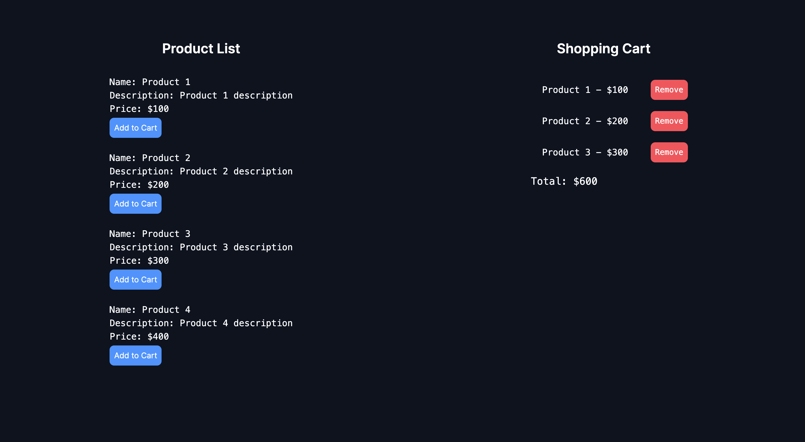

## React Assignment
### Built using Zustand and NextJs

### Requirements Fullfilled:

1️⃣ The application should have a product list page that displays a list of products, with the ability to add items to a shopping cart.

2️⃣ The shopping cart should be displayed on the product list page, showing the current items in the cart and the total price.

3️⃣ The shopping cart should persist across pages, so that if the user navigates away from the product list page and comes back, their cart should still be there.

4️⃣ The cart should be implemented using Zustand state management library.

5️⃣ You should use React Context API for the global state of the app.

6️⃣ You should use a CSS framework of your choice to style the application.

### First Look

